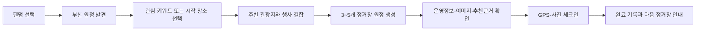

# TourAPI 기반 지역 원정 엔진 설계

**작성일:** 2026-08-22
**대상:** 2026 관광데이터 활용 공모전 웹·앱 구현 부문, 지정과제 3
**기준 자료:** `2026 관광데이터 활용 공모전_웹·앱구현부문 OT자료.pdf`

## 1. 목표

K-콘텐츠 및 아티스트 관련 관광 인프라의 수도권 편중과 글로벌 팬덤의
지방 도시 방문·탐방 불편을 해결한다. 부산을 첫 지역으로 삼아 사용자가
관심 키워드에서 출발해 실제 지역 관광지로 이어지는 3~5개 정거장 원정을
발견하고, 운영 정보와 추천 근거를 확인하고, GPS와 현장 사진으로 방문을
기록할 수 있는 완성형 웹 흐름을 제공한다.

한국관광공사 OpenAPI는 단순 출처 표기가 아니라 검색, 주변 탐색, 상세정보,
행사, 이미지, 변경 감지와 추천 결과를 결정하는 서비스 핵심 데이터로
사용한다. 파일로 내려받은 관광 데이터는 제품 데이터로 사용하지 않는다.

## 2. 공모전 기준과 제품 제약

- 지정과제 3의 문제와 해결 연결을 첫 화면과 기능설명서에서 명확히 설명한다.
- 실제 서버가 공사 OpenAPI를 호출하고 PostgreSQL에 최근 정상 데이터를
  캐시한다.
- 제출 증빙을 위해 사용한 API 신청정보와 별도로, 비밀키가 제거된 호출 내역,
  호출 기능, 응답 건수, 성공 여부와 갱신 시각을 보존한다.
- 공개 서비스 이름과 화면에서 `한국관광공사`, `KTO`, 공사 로고를 사용하지
  않는다. 공개 카피는 `관광 OpenAPI`, `공공 관광데이터`로 제한한다.
- 소스 코드, 운영 문서, 제출용 기능설명서에서는 정확한 API 상품명과
  operation 이름을 사용한다.
- 브라우저 번들에 서비스 키, DB 비밀번호, 신뢰 사용자 헤더가 들어가지 않는다.
- upstream 장애나 일일 트래픽 소진 시 최근 정상 스냅샷으로 탐색과 체크인을
  계속 제공한다.
- 부산 코드 `6`을 MVP 기본값으로 사용하되 모든 저장·조회 인터페이스는
  지역코드를 매개변수로 받아 이후 전국 확장이 가능해야 한다.

## 3. 현재 상태와 핵심 간극

현재 백엔드는 `areaBasedList2`와 `detailCommon2`로 부산 장소 100개를
동기화하며, 프론트엔드는 실제 장소 목록에서 GPS·사진 체크인을 시작한다.
하지만 원정 화면은 고정 demo 데이터이고 실제 장소 목록은 독립 카드 모음이다.
따라서 API 데이터가 `전국 탐험 → 지역 원정 → 현장 체크인` 흐름을 만들지
못하고, 심사자가 API가 어떤 사용자 가치를 만드는지 확인하기 어렵다.

이번 변경은 실제 관광데이터를 원정 엔진의 입력으로 만들고, 각 결과에
데이터 기반 추천 이유와 갱신 상태를 노출하여 이 간극을 닫는다.

## 4. 사용자 흐름

### 4.1 원정 발견

사용자는 부산과 관심 키워드를 선택한다. 서버는 실 API 동기화에서 확보한
키워드 일치 장소를 원정의 anchor로 사용한다. anchor가 없으면 부산의 활성
관광지 중 카테고리 다양성을 가장 잘 확보하는 장소를 선택하고 이 fallback을
추천 이유에 명시한다.

### 4.2 원정 구성

원정은 anchor를 포함해 최대 5개 정거장으로 구성한다. 후보는 다음 순서로
선정한다.

1. 공개·활성 상태이고 좌표와 공통 설명이 있는 장소만 사용한다.
2. anchor에서 가까운 장소를 우선한다.
3. 동일 콘텐츠 유형만 반복되지 않도록 문화, 음식, 행사 카테고리를 순환한다.
4. 서비스 내부 완료 체크인 수가 적은 장소를 동률에서 우선해 저노출 장소의
   발견 가능성을 높인다.
5. 사용자가 지정한 여행일에 포함되는 행사를 후보에 포함한다.

추천 결과에는 `키워드 일치`, `반경 N km`, `다른 유형의 지역 명소`,
`여행일에 열리는 행사`, `아직 방문 기록이 적은 장소` 중 실제로 적용된 이유만
표시한다. 교통시간, 영업 중 여부, 혜택이나 포인트는 원본 데이터나 제품 규칙이
없는 경우 추정해 표시하지 않는다.

### 4.3 상세와 체크인

각 정거장은 공통 설명, 주소, 이미지 갤러리, 콘텐츠 유형별 운영정보와 갱신
시각을 제공한다. 기존 체크인 API에 동일한 `place.id`를 전달하므로 GPS·사진
수집과 pending 제출 흐름을 그대로 사용한다. 제출 성공 후 프론트는 해당
정거장을 완료 상태로 표시하되 승인이나 포인트 지급을 주장하지 않는다.

## 5. OpenAPI 활용 지도

| operation | 제품 기능 | 저장·증빙 |
|---|---|---|
| `areaBasedList2` | 부산 전체 후보 카탈로그 | 장소 기본 필드, 호출 로그 |
| `searchKeyword2` | K-콘텐츠 키워드 anchor 발견 | 장소 키워드, 호출 로그 |
| `locationBasedList2` | anchor 반경의 지역 장소 발견 | 발견 반경·anchor, 호출 로그 |
| `detailCommon2` | 설명, 주소, 좌표, 홈페이지 | 장소 공통 상세 |
| `detailIntro2` | 운영시간, 휴무, 주차 등 유형별 안내 | JSON 상세과 요약 필드 |
| `detailInfo2` | 코스, 메뉴, 행사 반복 정보 | JSON 상세 |
| `detailImage2` | 관광지 이미지 갤러리 | HTTPS 이미지 URL 목록 |
| `searchFestival2` | 여행 기간에 열리는 지역 행사 | 행사 시작·종료일 |
| `areaBasedSyncList2` | 변경·삭제된 콘텐츠 증분 감지 | 변경 시각과 동기화 실행 |

모든 호출은 기존 `KTourOpenAPIClient._request()`를 통과한다. transport는
호출별 `operation`, 목적 feature, HTTP 결과, 안전한 오류코드, 응답 건수,
시작·종료 시각을 수집한다. URL과 query string, service key, 원문 오류 body는
로그와 API 응답에 저장하지 않는다.

## 6. 백엔드 구조

### 6.1 어댑터

- `ktour_openapi.py`는 공통 transport, 응답 계약 검증과 호출 관측 이벤트를
  담당한다.
- `ktour_expedition.py`는 9개 operation의 매개변수와 응답을 typed DTO로
  변환한다.
- operation별 mapper는 독립 함수로 두어 콘텐츠 유형별 필드 차이를 격리한다.
- 외부 호출 동시성은 최대 5, 재시도는 기존 정책을 유지한다.

### 6.2 동기화

`TourismExpeditionSyncService`는 한 실행에서 다음 단계를 수행한다.

1. `areaBasedSyncList2`로 변경 후보를 확인한다.
2. 최초 실행 또는 강제 전체 실행이면 `areaBasedList2`를 페이지 단위로 읽는다.
3. 구성된 K-콘텐츠 키워드는 `searchKeyword2`로 검색한다.
4. 검색 anchor 주위 후보를 `locationBasedList2`로 읽는다.
5. 동기화 범위의 콘텐츠를 common, intro, info, image로 보강한다.
6. 현재 여행 기간의 행사를 `searchFestival2`로 병합한다.
7. 하나의 DB transaction에서 장소·상세·이미지·키워드·행사를 upsert한다.
8. validated row가 0개이거나 필수 단계가 실패하면 새 스냅샷을 공개하지 않는다.

API 호출 로그는 각 호출 직후 별도 짧은 transaction으로 기록하여 전체 스냅샷
실패도 증빙한다. 비밀값은 기록하지 않는다.

### 6.3 추천 서비스

`ExpeditionRecommendationService.recommend()`는 PostgreSQL의 최근 정상
스냅샷만 사용한다. upstream을 사용자 요청 경로에서 호출하지 않아 심사 중
응답 안정성과 트래픽 제한을 보호한다. Haversine 거리, 카테고리 다양성,
완료 체크인 수를 deterministic하게 조합하며 동일 입력은 같은 순서와 추천
이유를 반환한다.

### 6.4 API

- `GET /api/v1/expeditions/recommended`
  - query: `regionCode=6`, optional `keyword`, `travelDate`, `limit=3..5`
  - response: 원정 메타데이터, 추천 근거, 장소 상세, 데이터 갱신 시각
- `GET /api/v1/open-data/status`
  - 공개 가능한 operation별 마지막 성공 시각과 반영 건수
  - 제공기관 명칭, 키, 신청자 정보, raw URL은 반환하지 않음
- 기존 `GET /api/v1/places`와 체크인 API는 호환성을 유지한다.

## 7. 데이터 모델

### `places` 확장

- `homepage_url`, `telephone`, `open_time`, `rest_date`, `parking`
- `intro_json`, `info_json`, `image_urls`
- `festival_start_date`, `festival_end_date`
- `discovery_keywords`, `source_operations`

JSON 필드는 upstream 구조 차이를 보존하되 공개 API는 안정된 요약 필드만
노출한다. 이미지 URL은 HTTPS만 허용한다.

### `open_api_call_logs`

- `id`, `sync_run_id`, `operation`, `feature`
- `status` (`succeeded`, `failed`), `response_count`, `error_code`
- `started_at`, `completed_at`

service key, 요청 URL, 신청자 정보와 upstream body는 컬럼으로 만들지 않는다.

### 원정

추천 원정은 이번 MVP에서 별도 테이블에 영속화하지 않는다. 원정 ID는
`regionCode + keyword + travelDate + snapshotVersion`의 안정된 digest로 만든다.
체크인 자체는 기존 영속 모델을 사용한다.

## 8. 프론트엔드

- 기존 독립 `LivePlacesPanel`을 원정 발견 패널로 교체한다.
- 실제 추천 API를 호출해 3~5개 정거장과 추천 근거를 표시한다.
- 장소 카드는 운영정보, 이미지 수, 데이터 갱신 시각을 보여준다.
- `현장 체크인`은 기존 `CheckInFlow`를 그대로 연다.
- 심사용 데이터 활용 영역은 `관광 OpenAPI 활용 현황`이라는 공개 카피로
  operation 수, 최근 갱신, 정상 반영 건수를 표시한다.
- `LIVE KTOUR DATA`, `한국관광공사 데이터`, 공사 로고는 공개 UI와 metadata에서
  제거한다.
- API 오류 시 최근 장소 목록을 유지하고 재시도 UI를 제공한다.

## 9. 오류·보안·운영

- 일시 오류와 5xx는 bounded retry 후 실패 로그를 남긴다.
- 인증 오류, 잘못된 매개변수와 contract 오류는 재시도하지 않는다.
- 동기화 실패는 기존 장소를 비활성화하지 않는다.
- 부분 상세 실패는 해당 optional 상세만 비우고 기본 장소는 유지하되,
  common 설명·주소·좌표 실패는 그 장소를 제외한다.
- 공개 API는 upstream 오류문, URL, service key를 반환하지 않는다.
- 일일 요청량을 보호하기 위해 상세 호출은 수정된 content ID에 우선하고,
  강제 전체 동기화는 운영자 CLI에서만 수행한다.

## 10. 테스트와 심사 증빙

### 자동 테스트

- adapter contract: 9개 operation의 정확한 query, mapping, malformed payload
- migration: 확장 컬럼과 호출 로그 제약
- sync integration: full, incremental, last-good fallback, 비밀값 미저장
- recommendation: 거리, 다양성, 저방문 우선, 행사 날짜, deterministic ID
- API: 추천 원정·상태 schema와 기존 place/check-in 회귀
- web: 발견 → 추천 이유 → 정거장 → 체크인 흐름, 오류 복구, 금지 명칭 부재
- build: lint, unit/integration/E2E, production build

### 실 API 검증

ignored `.env`의 Decoding 일반 인증키로 부산 동기화를 실행한다. 성공 조건은
9개 operation 호출 로그가 존재하고, 추천 API가 3개 이상의 실제 장소와
비어 있지 않은 추천 이유·갱신 시각을 반환하는 것이다. 출력과 로그를 키 문자열로
검사하여 비밀 노출이 없음을 확인한다.

### 제출용 증빙

저장소에 `docs/competition/openapi-utilization.md`를 생성해 operation별 사용자
기능, 호출 시점, 저장 필드, 장애 대체 경로, 실제 검증 명령과 스크린샷 위치를
정리한다. 신청자명·신청자 인증키는 저장소에 넣지 않고 제출 양식에만 입력한다.

## 11. 완료 기준

- 부산 실데이터로 추천 원정 1개 이상이 생성된다.
- 원정에는 서로 다른 카테고리의 실제 장소 3개 이상과 추천 이유가 있다.
- 상세에서 운영정보 또는 이미지 갤러리 중 하나 이상을 확인할 수 있다.
- 원정 정거장에서 기존 GPS·사진 체크인을 시작하고 pending 제출까지 가능하다.
- 9개 operation의 실제 호출 증빙이 비밀값 없이 기록된다.
- upstream 실패 시 마지막 정상 장소와 원정을 계속 조회한다.
- 공개 화면과 metadata에 금지된 공사 명칭·로고가 없다.
- 전체 Python 테스트, API/integration/E2E, web test, lint와 production build가
  모두 통과한다.
