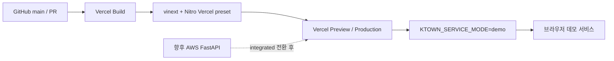

# Vercel 데모 프론트엔드 배포 설계

## 1. 목표

AWS 백엔드 연결 전에 K-Town Defense 웹을 Vercel Preview와 Production에
배포한다. 이번 단계는 사용자가 공개 HTTPS 주소에서 제품 흐름과 UI를 체험할
수 있는 데모 프론트엔드 배포까지를 범위로 한다. FastAPI, PostgreSQL, 사진
저장소는 Vercel로 이전하지 않는다.

배포 결과는 다음 조건을 만족해야 한다.

- GitHub 저장소를 Vercel에 연결하고 `web`을 프로젝트 Root Directory로 쓴다.
- Preview와 Production 모두 외부 백엔드 없이 `demo` 모드로 렌더링된다.
- 기존 Cloudflare/Sites용 개발·빌드 경로를 깨뜨리지 않는다.
- Vercel용 빌드는 Cloudflare 런타임 의존 없이 Nitro의 Vercel preset으로
  서버 컴포넌트와 라우트 핸들러를 패키징한다.
- 비밀값이나 로컬 주소를 브라우저 번들 또는 Git에 넣지 않는다.

## 2. 현재 구조와 제약

`web`은 Next.js App Router API 표면을 `vinext`로 실행한다. 현재
`vite.config.ts`는 `@cloudflare/vite-plugin`과 로컬 Workers 설정을 포함하므로
그대로 Vercel 빌드에 사용하면 플랫폼별 런타임이 충돌할 수 있다.

페이지는 `KTOWN_SERVICE_MODE`가 `integrated`일 때만 FastAPI 게이트웨이를
사용하며, 그 밖에는 fixture 기반 데모 서비스를 사용한다. 운영 게이트웨이의
사용자 식별은 Sites가 제공하는 `oai-authenticated-user-id`에 의존한다. Vercel은
이 헤더를 제공하지 않으므로 이번 배포에서 통합 체크인을 활성화하지 않는다.

## 3. 접근 방식

### 채택: 플랫폼별 Vite 설정 분리

기존 `vite.config.ts`는 Cloudflare/Sites용으로 유지하고, Vercel 전용 Vite
설정을 별도 파일로 둔다. Vercel 설정은 `vinext()`와 `nitro()`만 등록한다.
Vercel CI에서는 전용 npm script가 이 설정과 `NITRO_PRESET=vercel`을 사용한다.

장점은 현재 로컬 개발과 기존 호스팅 경로를 보존하면서 Vercel 산출물을 독립
검증할 수 있다는 점이다. 이후 AWS 연결 시 프론트 빌드 구조를 다시 바꿀 필요
없이 서버 전용 환경변수와 인증 어댑터만 교체할 수 있다.

### 보류: 순정 Next.js로 즉시 전환

Vercel과의 결합은 가장 단순하지만 현재 vinext·Vite 기반 의존성과 빌드 도구를
한 번에 교체해야 한다. 이번 배포 검증 범위를 넘어가므로 보류한다.

### 제외: FastAPI까지 Vercel에 임시 배포

외부 PostgreSQL, 영속 사진 저장소, 사용자 인증을 함께 설계해야 한다. Vercel
Services도 현재 Private Beta이므로 AWS 이전의 임시 경로로 채택하지 않는다.

## 4. 파일과 명령 구조

- `web/vite.config.vercel.ts`
  - `vinext()`와 `nitro()`만 포함한다.
  - Cloudflare Workers binding과 `.openai/hosting.json`을 읽지 않는다.
- `web/package.json`
  - `build:vercel`: Vercel preset으로 전용 설정을 빌드한다.
  - 기존 `dev`, `build`, `start`는 유지한다.
- `web/vercel.json`
  - Nitro framework, Vercel 빌드 명령, `.output` 산출물을 선언한다.
- `web/.env.example`
  - 배포 단계별 변수와 서버 전용 규칙을 설명한다.
- `web/README.md`
  - Dashboard 연결, Preview 검증, Production 승격, AWS 전환 절차를 기록한다.
- `web/tests/vercel-deployment.test.ts`
  - 설정 파일, script, 환경변수 안전 규칙을 회귀 검증한다.

## 5. 배포 데이터 흐름



데모 모드에서는 브라우저가 `/api/ktown/*`를 호출하지 않는다. 따라서 아직
공개되지 않은 로컬 FastAPI 주소가 Vercel 함수에서 호출되는 일도 없다.

## 6. 환경변수와 보안

Vercel Dashboard의 Preview와 Production에 다음 값만 설정한다.

```text
KTOWN_SERVICE_MODE=demo
```

`KTOWN_API_BASE_URL`, `KTOWN_DEV_USER_ID`, `KTOUR_SERVICE_KEY`, 데이터베이스
URL은 설정하지 않는다. 어떤 배포 변수에도 `NEXT_PUBLIC_` 접두사를 붙이지
않는다. `.vercel/`, `.env.local`, Vercel 토큰과 프로젝트 ID는 Git에서 제외한다.

AWS 연결 시에는 다음을 별도 변경으로 수행한다.

- `KTOWN_SERVICE_MODE=integrated`
- 서버 전용 `KTOWN_API_BASE_URL=https://api.example.com`(실제 AWS API 주소로 교체)
- Vercel에서 검증 가능한 사용자 세션을 게이트웨이의 신뢰 헤더로 변환
- Preview와 Production에 서로 다른 백엔드·데이터베이스 사용

## 7. 오류 처리

- Vercel 전용 빌드가 Cloudflare module을 포함하면 테스트 또는 빌드가 실패해야
  한다.
- 데모 모드가 아닌데 백엔드 URL이나 인증이 없으면 통합 배포를 승인하지 않는다.
- Preview에서 페이지 렌더링, 팬덤 선택, 탐색, 데모 체크인 시작까지 확인한 뒤
  동일 artifact 또는 `main` 배포를 Production으로 승격한다.
- 배포 실패 시 Production을 덮어쓰지 않고 Preview 로그에서 원인을 확인한다.

## 8. 테스트 전략

1. 설정 테스트를 먼저 작성해 Vercel config와 전용 script가 없어서 실패하는
   것을 확인한다.
2. Nitro와 Vercel 설정을 최소 구현한다.
3. `npm run build:vercel`로 `.output` 산출물과 서버 entrypoint를 확인한다.
4. 기존 `npm test`, `npm run lint`, `npm run build`를 실행해 Cloudflare/Sites
   경로가 유지되는지 확인한다.
5. Vercel Preview에서 공개 HTTPS smoke test를 실행한다.

## 9. 완료 기준

- Vercel용 설정 테스트와 기존 39개 이상 웹 테스트가 통과한다.
- 기존 build와 Vercel build가 모두 성공한다.
- Vercel 산출물에 `.env`, API 키, 데이터베이스 URL이 포함되지 않는다.
- README만 보고 GitHub Import와 환경변수 설정을 완료할 수 있다.
- Preview URL에서 데모 사용자 여정을 실제 브라우저로 검증한다.
- AWS 통합 전환에 필요한 미완료 항목이 명확히 분리되어 있다.
